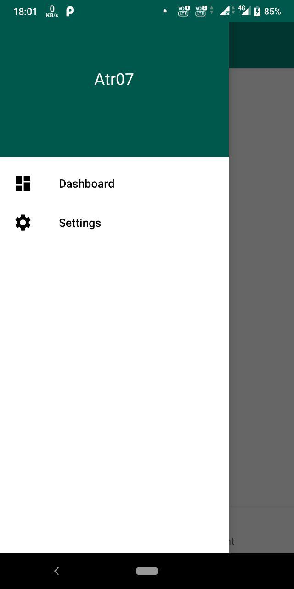

# Drawer With Bottom Navigation (Android Navigation Architecture)

Sample android kotlin project with both drawer and bottom navigation together

SF : https://stackoverflow.com/questions/55990820/how-to-use-navigation-drawer-and-bottom-navigation-simultaneously-navigation-a/

   

   

   

[APK for testing](extras/drawer.with.bottom.navigation.architecture.v1.1.apk)
